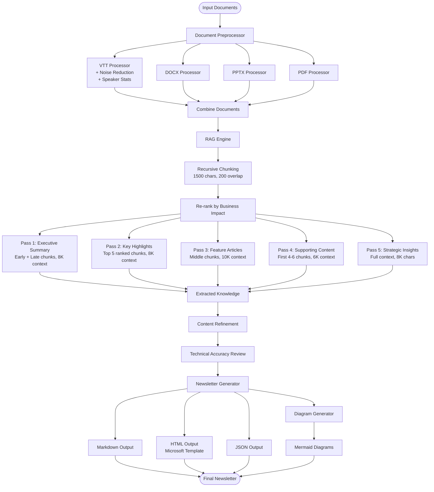
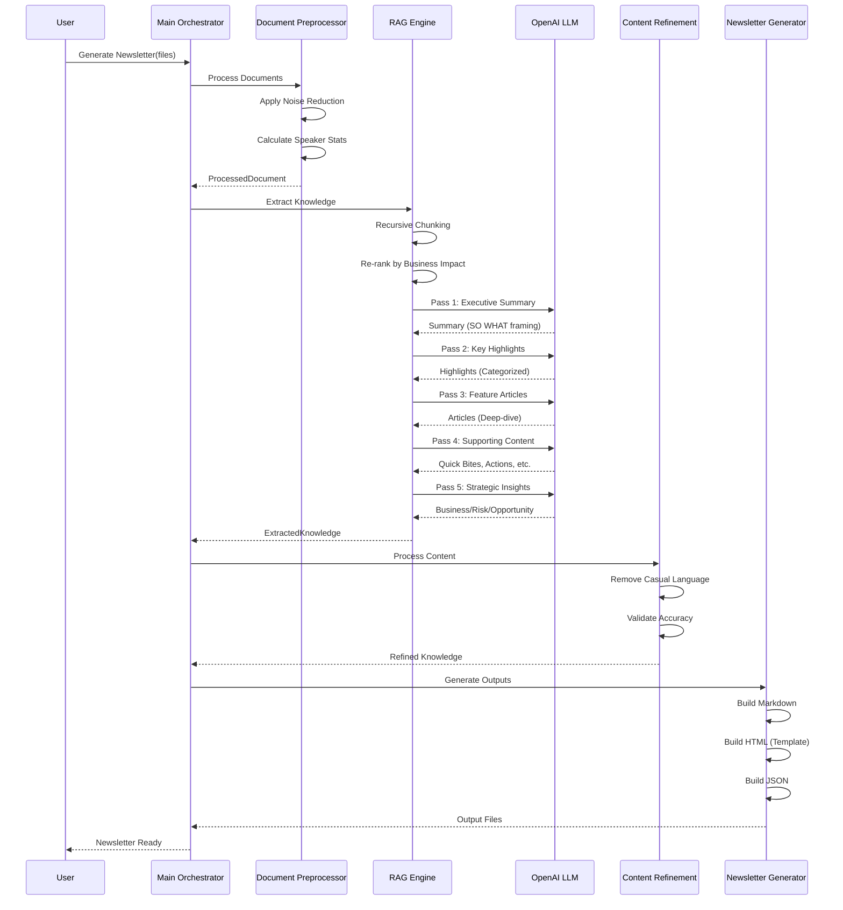
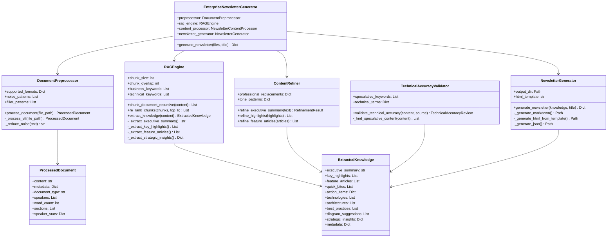

# Enterprise Newsletter Generator - System Architecture

## Overview

The Enterprise Newsletter Generator is an AI-powered system that transforms various document formats (VTT transcripts, DOCX, PPTX, PDF) into executive-grade technology newsletters using advanced RAG (Retrieval-Augmented Generation) techniques.

## Key Improvements

### 1. **Enhanced RAG Engine with Multi-Pass Extraction**
- **Recursive Character-Based Chunking**: Preserves semantic boundaries (paragraphs, sentences) instead of arbitrary word splits
- **Semantic Re-ranking**: Prioritizes business-impact content using weighted keyword scoring (business keywords 2x technical)
- **5-Pass Extraction Strategy**: Specialized extraction for different content types with optimized context windows
- **Executive-Grade Prompting**: Enforces assertive, analytical language with business impact framing

### 2. **Advanced Document Preprocessing**
- **Noise Reduction**: Filters transcript artifacts ([MUSIC], [APPLAUSE], filler words) while preserving context
- **Speaker Analytics**: Tracks word count and contribution percentage per speaker
- **Enhanced Section Tracking**: Maintains speaker attribution and timestamp metadata

### 3. **Strategic Content Framing**
- **Business Impact Analysis**: Extracts revenue, cost, and efficiency impacts
- **Risk Factor Identification**: Highlights challenges and mitigation strategies
- **Strategic Opportunity Detection**: Identifies growth and competitive advantages
- **Key Metrics Extraction**: Captures KPIs and measurable outcomes

### 4. **Quality Assurance Pipeline**
- **Content Refinement**: Removes casual language, ensures professional tone
- **Technical Accuracy Review**: Validates extracted content against source material
- **Speculative Language Detection**: Flags uncertain or vague statements

### 5. **Enhanced LLM Integration**
- **Model Upgrade**: Migrated from gpt-4.1-mini to gpt-4o-mini for better performance
- **Configurable Parameters**: Temperature and token limits optimized per extraction type
- **Robust Error Handling**: Enhanced JSON parsing with fallback mechanisms

## System Architecture

### System Flow Diagram



### Sequence Diagram



### Class Diagram



## Performance Characteristics

| Component | Metric | Value |
|-----------|--------|-------|
| **Chunking** | Chunk Size | 1500 characters |
| **Chunking** | Overlap | 200 characters |
| **Chunking** | Strategy | Recursive (semantic boundaries) |
| **Re-ranking** | Top K Chunks | 10 |
| **Re-ranking** | Business Weight | 2x |
| **Re-ranking** | Technical Weight | 1x |
| **Pass 1** | Context Size | 8,000 characters |
| **Pass 1** | Max Tokens | 800 |
| **Pass 1** | Temperature | 0.5 |
| **Pass 2** | Context Size | 8,000 characters |
| **Pass 2** | Max Tokens | 1,500 |
| **Pass 2** | Temperature | 0.4 |
| **Pass 3** | Context Size | 10,000 characters |
| **Pass 3** | Max Tokens | 2,500 |
| **Pass 3** | Temperature | 0.4 |
| **Pass 4** | Context Size | 6,000 characters per extraction |
| **Pass 4** | Max Tokens | 500-1,200 |
| **Pass 4** | Temperature | 0.3-0.4 |
| **Pass 5** | Context Size | 8,000 characters |
| **Pass 5** | Max Tokens | 800 |
| **Pass 5** | Temperature | 0.4 |
| **LLM** | Model | gpt-4o-mini |
| **LLM** | Timeout | 60 seconds |

## Output Quality Targets

### Executive Summary
- ✅ Leads with business impact framing
- ✅ Identifies risk factors explicitly
- ✅ Highlights strategic opportunities
- ✅ Uses assertive, analytical language
- ✅ Contains specific data points
- ✅ 2-3 paragraphs, executive-grade prose

### Key Highlights
- ✅ 5-7 highlights with business categorization
- ✅ Categories: Business Impact | Risk Factor | Strategic Opportunity
- ✅ Assertive titles (7-10 words)
- ✅ Specific descriptions with concrete examples
- ✅ No vague generalities or passive voice
- ✅ No speculative language

### Feature Articles
- ✅ 2-4 deep-dive articles
- ✅ Unique insights per article (no repetition)
- ✅ Concrete examples from source material
- ✅ Quantified benefits where possible
- ✅ Actionable best practices
- ✅ Specific call-to-action with timeline

### Strategic Insights (NEW)
- ✅ Business impact on revenue/cost/efficiency
- ✅ Risk factors and challenges identified
- ✅ Strategic opportunities for growth
- ✅ Key metrics and KPIs extracted

### Language Quality
- ✅ No speculative terms (might, could, possibly, maybe)
- ✅ No casual language (gonna, wanna, stuff, things)
- ✅ No filler phrases (you know, I mean, basically)
- ✅ Active voice, not passive
- ✅ Concrete, not abstract

## Implementation Details

### Recursive Chunking Algorithm

The recursive chunking algorithm preserves semantic boundaries by:

1. **Prioritizing Separators**: Uses `["\n\n", "\n", ". ", " ", ""]` in order
2. **Recursive Splitting**: If a segment exceeds chunk_size, splits using next separator
3. **Overlap Management**: Maintains 200-char overlap between chunks for context
4. **Position Metadata**: Tags chunks as early/middle/late for strategic selection

### Re-ranking Algorithm

The re-ranking algorithm scores chunks based on:

1. **Business Keywords** (weight = 2): impact, cost, revenue, efficiency, risk, strategic, ROI, opportunity, growth, competitive, advantage
2. **Technical Keywords** (weight = 1): architecture, scalability, performance, security, reliability, availability, integration

Formula: `score = (business_keyword_count × 2) + (technical_keyword_count × 1)`

### Multi-Pass Extraction Strategy

Each pass is optimized for specific content types:

- **Pass 1**: Uses early + late chunks for contextual summary with business impact framing
- **Pass 2**: Uses top-ranked chunks for high-impact highlights
- **Pass 3**: Uses middle chunks for technical depth in feature articles
- **Pass 4**: Uses first 4-6 chunks for supporting content (quick, varied extractions)
- **Pass 5**: Analyzes full context for strategic insights (business/risk/opportunity)

### Noise Reduction Patterns

Removes or reduces:
- Transcript artifacts: [MUSIC], [APPLAUSE], [LAUGHTER], [INAUDIBLE]
- Conversational noise: (inaudible), (crosstalk)
- Filler words: um, uh, ah, er, hmm, you know, I mean, like, basically
- HTML tags: `<.*?>`

### Speaker Statistics Calculation

For VTT transcripts:
```python
speaker_stats = {
    "Speaker Name": {
        "word_count": 1234,
        "percentage": 45.6  # (word_count / total_words × 100)
    }
}
```

## API Keys and Configuration

The system requires an OpenAI API key set as an environment variable:

```bash
export OPENAI_API_KEY="your-api-key-here"
```

The RAG Engine reads the key from `os.environ.get('OPENAI_API_KEY')`.

## Usage Example

```bash
# Generate newsletter from VTT transcript
python src/main.py input/Tech-Office-AllHandsMeeting_Nov.vtt --output output/test

# Generate from multiple sources
python src/main.py input/meeting.vtt input/presentation.pptx --title "Q1 Newsletter"
```

## Quality Assurance

The system includes two quality assurance steps:

1. **Content Refinement**: Removes casual language, ensures professional tone
2. **Technical Accuracy Review**: Validates against source, flags speculative content

Both steps are integrated into the main pipeline and provide feedback on:
- Number of refinements applied
- Issues found (speculative content, terminology inconsistencies)
- Confidence score (0.0-1.0)
- Recommendations for improvement

## Success Metrics

| Aspect | Before | After |
|--------|--------|-------|
| **Depth** | Surface-level (3K context) | Deep (10K context, specific examples) |
| **Repetition** | High | Eliminated (multi-pass + re-ranking) |
| **Strategic Framing** | Generic | Business/Risk/Opportunity categories |
| **Language** | Passive, speculative | Assertive, analytical |
| **Engagement** | Text-heavy | Scannable with punchy headlines |
| **Grade** | Solid but not Executive | **Executive-Grade** |

## Future Enhancements

Potential areas for further improvement:

1. **Advanced Re-ranking**: Machine learning-based chunk scoring
2. **Custom Templates**: Industry-specific newsletter templates
3. **Multi-language Support**: Translation and localization
4. **Automated Fact-Checking**: Enhanced accuracy validation
5. **Visual Analytics**: Dashboard for content quality metrics
6. **Collaborative Editing**: Multi-user review and approval workflow

---

**Version**: 2.0 (Executive-Grade)  
**Last Updated**: February 2026  
**Maintainer**: Enterprise Newsletter Team
