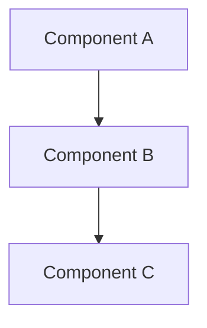
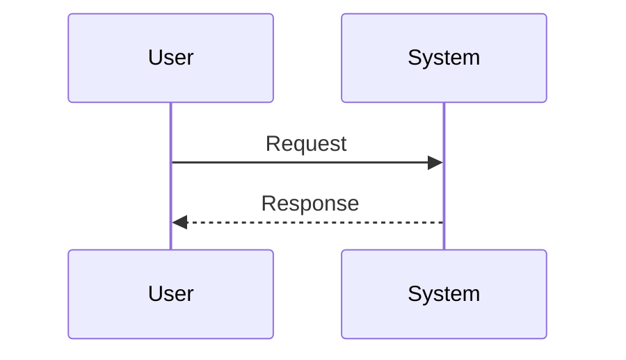
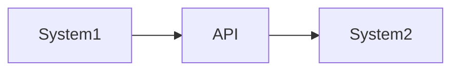
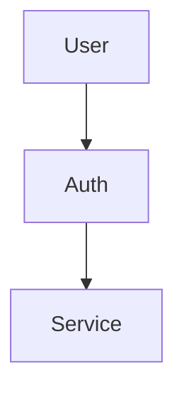
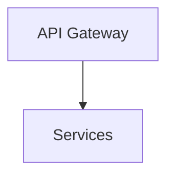
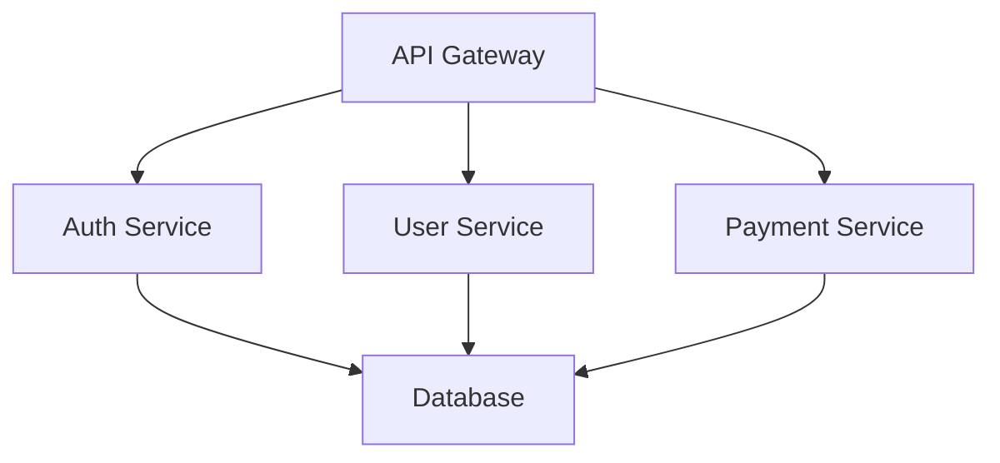
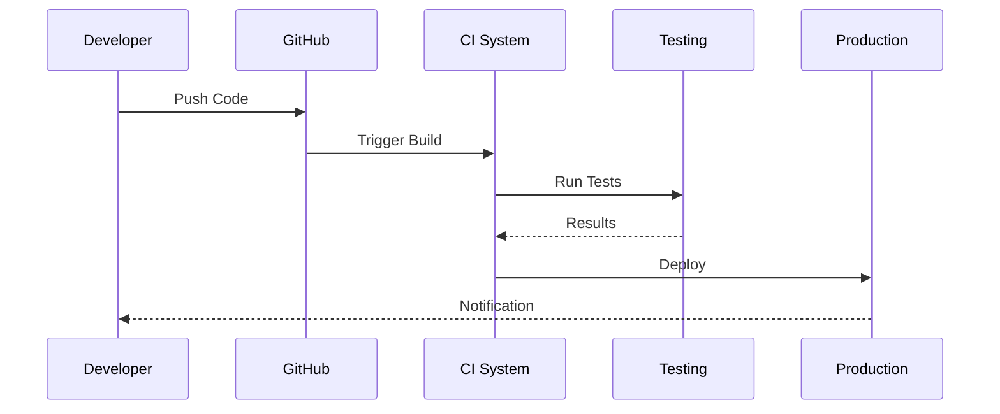

# Diagram Generation and Embedding

## Overview

The newsletter generation system now automatically creates and embeds contextually relevant technical diagrams in all output formats (HTML, Markdown, and JSON). This enhancement provides visual representations of architectures, workflows, integrations, and security models directly within the newsletter.

## Features

### 1. Multiple Diagram Formats

Each diagram is automatically generated in three formats:

- **Mermaid.js** - For direct embedding in Markdown and HTML with live rendering
- **Eraser.io** - For external editing and customization
- **ASCII** - For plain text fallback

### 2. Intelligent Diagram Generation

The system uses LLM (GPT-4o-mini) to generate context-aware diagrams based on:
- Diagram type (architecture, workflow, integration, security)
- Key elements extracted from content
- Available technologies
- System architectures
- Content context (up to 5000 characters)

### 3. Smart Fallback System

When LLM is unavailable or fails, the system uses template-based diagrams:
- Architecture diagrams with connected components
- Workflow diagrams with user-system interactions
- Integration diagrams with system connections

### 4. Seamless Integration

Diagrams are automatically embedded in:
- **HTML Newsletter** - Rendered with Mermaid.js, styled with Microsoft Fluent UI
- **Markdown Newsletter** - Mermaid.js code blocks for GitHub/wiki rendering
- **JSON Newsletter** - Complete diagram data including Mermaid code

## Diagram Types

### Architecture Diagrams

**Use Case**: System architecture, cloud infrastructure, service composition

### Workflow Diagrams

**Use Case**: Process flows, API request flows, user interactions

### Integration Diagrams

**Use Case**: System integrations, API connections, data flows

### Security Diagrams

**Use Case**: Authentication flows, authorization models, security architecture

## Usage

### Automatic Generation

Diagrams are automatically generated when the RAG engine suggests them:

```python
# In main.py - Step 4
diagrams = []
if knowledge.diagram_suggestions:
    for suggestion in knowledge.diagram_suggestions:
        diagram = self.diagram_generator.generate_diagram_from_suggestion(
            suggestion=suggestion,
            context={
                'technologies': knowledge.technologies,
                'architectures': knowledge.architectures,
                'full_content': combined_doc.content[:5000]
            }
        )
        diagrams.append(diagram)
```

### Manual Creation

You can also create diagrams programmatically:

```python
from diagram_generator import DiagramGenerator

generator = DiagramGenerator(output_dir="./output/diagrams")

diagram_suggestion = {
    'title': 'Cloud Architecture',
    'type': 'architecture',
    'purpose': 'Show cloud infrastructure',
    'elements': ['API Gateway', 'Services', 'Database'],
    'description': 'Main system architecture'
}

diagram = generator.generate_diagram_from_suggestion(
    suggestion=diagram_suggestion,
    context={
        'technologies': ['Kubernetes', 'Docker'],
        'architectures': [{'name': 'Microservices'}]
    }
)
```

## Output Files

### Per Diagram Files

Each diagram generates three files:

1. **`{diagram_name}.mermaid.md`** - Mermaid.js code in Markdown format
   ```markdown
   # Cloud Architecture
   
   ```mermaid
   graph TD
       A[API Gateway] --> B[Services]
   ```
   ```

2. **`{diagram_name}.eraser`** - Eraser.io diagram code
   ```
   // Cloud Architecture
   APIGateway [icon: cloud] > Services [icon: server]
   ```

3. **`{diagram_name}.txt`** - ASCII diagram
   ```
   Cloud Architecture
   ==================
   
   [API Gateway] --> [Services] --> [Database]
   ```

### Newsletter Outputs

#### HTML Newsletter
Diagrams are embedded in a dedicated section with:
- Microsoft Fluent UI styling
- Mermaid.js live rendering
- Responsive design
- Proper semantic HTML

```html
<div class="section diagrams-section">
  <h2 class="section-header">📊 Technical Architecture & Diagrams</h2>
  <div class="diagram-container">
    <h3>Cloud Architecture</h3>
    <p class="diagram-purpose">Shows cloud infrastructure</p>
    <div class="mermaid">
      graph TD
          A[API Gateway] --> B[Services]
    </div>
    <p class="diagram-description">Main system architecture</p>
  </div>
</div>
```

#### Markdown Newsletter
Diagrams are embedded as Mermaid code blocks:

```markdown
## 📊 Technical Architecture & Diagrams

### Cloud Architecture

**Purpose:** Shows cloud infrastructure



*Main system architecture*
```

#### JSON Newsletter
Diagrams are included in the `diagrams` array:

```json
{
  "diagrams": [
    {
      "title": "Cloud Architecture",
      "type": "architecture",
      "purpose": "Shows cloud infrastructure",
      "elements": ["API Gateway", "Services", "Database"],
      "description": "Main system architecture",
      "mermaid_code": "graph TD\n    A[API Gateway] --> B[Services]"
    }
  ]
}
```

## Styling

### HTML Styling

Diagrams use Microsoft Fluent UI design system:

```css
.diagram-container {
    margin: 2rem 0;
    padding: 1.5rem;
    background: var(--ms-gray-10);
    border-left: 4px solid var(--ms-blue);
    border-radius: 4px;
}

.mermaid {
    background: white;
    padding: 1.5rem;
    border-radius: 4px;
    margin: 1rem 0;
    overflow-x: auto;
}
```

### Mermaid.js Library

The HTML template includes Mermaid.js from CDN:

```html
<script type="module">
  import mermaid from 'https://cdn.jsdelivr.net/npm/mermaid@10/dist/mermaid.esm.min.mjs';
  mermaid.initialize({ startOnLoad: true, theme: 'default' });
</script>
```

## Configuration

### Diagram Generator Options

```python
DiagramGenerator(
    output_dir="./output/diagrams"  # Directory for diagram files
)
```

### LLM Model

The system uses `gpt-4o-mini` for diagram generation:
- Temperature: 0.3 (for consistency)
- Max tokens: 800 (sufficient for diagrams)
- Timeout: 30 seconds

## Best Practices

### 1. Provide Good Context
Pass relevant context to improve diagram quality:
```python
context = {
    'technologies': ['Kubernetes', 'Docker', 'PostgreSQL'],
    'architectures': [{'name': 'Microservices'}],
    'full_content': content[:5000]
}
```

### 2. Use Descriptive Titles
Clear titles help with:
- File naming
- Section headers
- User understanding

### 3. Limit Elements
Keep diagrams focused:
- Max 15 nodes for architecture diagrams
- 5-7 steps for workflow diagrams
- 3-5 systems for integration diagrams

### 4. Test Fallbacks
Always test without LLM to ensure fallbacks work:
```python
# Diagram generator will use templates if LLM unavailable
diagram = generator.generate_diagram_from_suggestion(suggestion)
```

## Troubleshooting

### Diagrams Not Generated

**Problem**: No diagrams appear in newsletter

**Solutions**:
1. Check if `knowledge.diagram_suggestions` is populated
2. Verify OpenAI API key is set
3. Check diagram generator logs for errors
4. Ensure `diagrams` parameter is passed to newsletter generator

### Mermaid.js Not Rendering

**Problem**: HTML shows Mermaid code instead of diagram

**Solutions**:
1. Verify Mermaid.js library is loaded (check browser console)
2. Check CDN availability
3. Validate Mermaid syntax (use [Mermaid Live Editor](https://mermaid.live/))
4. Ensure proper HTML structure with `<div class="mermaid">`

### Invalid Diagram Code

**Problem**: LLM generates invalid Mermaid code

**Solutions**:
1. System automatically falls back to template diagrams
2. Check `fallback_mermaid` method for basic diagrams
3. Review LLM prompt for improvements
4. Increase temperature for more creative (but possibly less valid) diagrams

### File Naming Issues

**Problem**: Diagram files have weird names

**Solutions**:
1. `_sanitize_filename()` converts special chars to underscores
2. Spaces and hyphens become underscores
3. All lowercase for consistency
4. Example: "Cloud Architecture" → "cloud_architecture"

## Security Considerations

### HTML Escaping
All user-provided content is HTML-escaped:
```python
import html
title_safe = html.escape(title)
```

### Input Validation
- Element lists validated as proper lists
- Context data type-checked
- File paths sanitized

### CDN Usage
Mermaid.js loaded from trusted CDN:
```
https://cdn.jsdelivr.net/npm/mermaid@10/dist/mermaid.esm.min.mjs
```

## Future Enhancements

Potential improvements:
1. **Custom Themes** - Organization-specific Mermaid themes
2. **Diagram Caching** - Cache generated diagrams to reduce LLM calls
3. **Interactive Diagrams** - Add zoom, pan, click interactions
4. **Diagram Export** - Export as PNG/SVG from server
5. **Smart Placement** - Place diagrams near related content
6. **Diagram Templates** - User-defined diagram templates
7. **Multi-Language** - Support for PlantUML, D2, etc.

## Examples

### Example 1: Microservices Architecture

Input:
```python
{
    'title': 'Microservices Architecture',
    'type': 'architecture',
    'elements': ['API Gateway', 'Auth Service', 'User Service', 'Payment Service', 'Database'],
    'purpose': 'Show microservices decomposition',
    'description': 'Service-oriented architecture with dedicated services'
}
```

Output (Mermaid):


### Example 2: CI/CD Pipeline

Input:
```python
{
    'title': 'CI/CD Pipeline',
    'type': 'workflow',
    'elements': ['Developer', 'GitHub', 'CI System', 'Testing', 'Production'],
    'purpose': 'Show deployment workflow',
    'description': 'Automated deployment pipeline from code to production'
}
```

Output (Mermaid):


## API Reference

### DiagramSpec Dataclass

```python
@dataclass
class DiagramSpec:
    title: str                          # Diagram title
    diagram_type: str                   # architecture, workflow, integration, security
    purpose: str                        # Why this diagram exists
    elements: List[str]                 # Key components/participants
    description: str                    # Detailed description
    mermaid_code: Optional[str]         # Mermaid.js code
    eraser_code: Optional[str]          # Eraser.io code
    ascii_diagram: Optional[str]        # ASCII representation
    image_path: Optional[str]           # Path to .mermaid.md file
    embed_html: Optional[str]           # Ready-to-embed HTML
```

### DiagramGenerator Methods

#### `generate_diagram_from_suggestion(suggestion, context=None)`
Generate diagram from RAG suggestion with context.

**Parameters**:
- `suggestion` (Dict): Diagram specification from RAG
- `context` (Dict, optional): Additional context for generation

**Returns**: `DiagramSpec` with all formats

#### `save_diagram_documentation(diagrams, filename='diagrams_guide.md')`
Save markdown documentation for all diagrams.

**Parameters**:
- `diagrams` (List[DiagramSpec]): List of diagrams
- `filename` (str): Output filename

**Returns**: `Path` to documentation file

### Newsletter Generator Methods

#### `generate_newsletter(knowledge, title, subtitle, diagrams=None)`
Generate newsletter with embedded diagrams.

**Parameters**:
- `knowledge` (ExtractedKnowledge): Extracted content
- `title` (str): Newsletter title
- `subtitle` (str): Newsletter subtitle
- `diagrams` (List[DiagramSpec], optional): Diagrams to embed

**Returns**: Dict with file paths

## Support

For issues or questions:
1. Check this documentation
2. Review example outputs in `/tmp/diagram_test_output/`
3. Check test script at `/tmp/test_diagram_generation.py`
4. Review source code comments

## License

This feature is part of the autonewsletter system and follows the same license.
