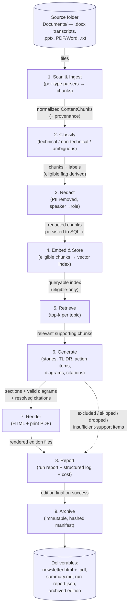

# RAG Engine Architecture & Pipeline Flow

**Describes**: the newsletter RAG engine delivered by feature `001-may-newsletter-pipeline`
**Engine version reflected**: `001-may-newsletter-pipeline` as of 2026-06-15 (constitution
v3.0.0 — editions are final upon generation; no review/approval gate; no automated tests)
**Status**: Descriptive reference only. This document explains how the engine works; it does
**not** change any pipeline behavior. Where this document and the code diverge, the
`001-may-newsletter-pipeline` artifacts are the source of truth.

---

## 1. Overview (plain language)

This engine turns a month's worth of raw meeting material into a polished technical
newsletter — automatically, from a single command. You drop the month's files (meeting
transcripts, slide decks, documents, notes) into a source folder and run one command; out
comes a finished, branded newsletter edition with feature stories, diagrams, and source
citations, plus a report of anything the engine left out.

It is a **RAG** pipeline — Retrieval-Augmented Generation. That means the language model does
not write from memory or imagination; it writes only from *your* source content. The journey
has three plain-language acts:

1. **Take everything apart and tidy it.** Every file is read and split into small passages
   (called **chunks**). Each chunk remembers exactly where it came from (which file, which
   slide/page/timestamp) — that record is its **provenance**. Personal and non-technical chatter
   is filtered out; private details (names, emails, phone numbers) are redacted.

2. **Find the relevant bits on demand.** Each kept chunk is turned into a numeric fingerprint
   (an **embedding**) and stored in a searchable index. When the engine writes about a topic,
   it **retrieves** the chunks most relevant to that topic instead of using everything at once.

3. **Write, illustrate, and publish — with receipts.** The model drafts narrative stories from
   the retrieved chunks, draws diagrams as code, and attaches a **citation** to each claim so it
   traces back to a real source location. The result is rendered into a web page and a print
   PDF, archived immutably, and accompanied by a transparency report.

If there isn't enough trustworthy source material for a topic, the engine omits it and says so
rather than inventing content. A producer with no engineering background can run it and trust
that everything in the edition came from the source files.

---

## 2. End-to-End Flow Diagram

The pipeline is one command — `newsletter run --month YYYY-MM` — that executes these stages in
order. Edges are labelled with the data handed from one stage to the next.



> A run can also end early as **`nothing_to_publish`** — if no eligible technical content
> survives classification, or no story survives citation validation. In that case stages 6–9
> short-circuit and only the run report is written.

---

## 3. Pipeline Stages (detail)

Each stage below lists its **Purpose**, **Inputs**, **Outputs**, what **Consumes** its output,
its **failure / empty-output** behavior, and its **Code location**. The orchestration lives in
`src/newsletter_engine/cli.py` (`run` command), which calls each stage in order.

### 3.1 Scan & Ingest

- **Purpose**: Recursively scan the source folder, detect each file's type, parse it with the
  matching parser, and emit normalized content chunks carrying full provenance.
- **Inputs**: The source folder (default `Documents/`, configurable via `--source` /
  `config.yaml`), including subfolders the producer adds per meeting/topic.
- **Outputs**: A set of `SourceDocument` records and a flat list of normalized `ContentChunk`s,
  each with provenance (source file, input type, location, ingestion time); plus a
  **skipped-files** list with reasons.
- **Consumed by**: Stage 2 (Classify).
- **On failure / empty output**: A corrupt/unreadable file is recorded with a `skip_reason` and
  the run continues — a bad file never aborts the run (FR-004). An empty source folder leads to
  `nothing_to_publish`.
- **Code location**: `src/newsletter_engine/ingestion/scanner.py` (`ingest`), parsers in
  `ingestion/parsers/` (`transcript_docx.py`, `pptx.py`, `document.py`, `text.py`),
  `ingestion/chunker.py`.

**Supported input types** (FR-002):

| Input type | Parser | Provenance location captured |
|------------|--------|------------------------------|
| Meeting transcript (`.docx`) | `parsers/transcript_docx.py` | speaker turn + timestamp |
| PowerPoint deck (`.pptx`) | `parsers/pptx.py` | slide number |
| Document (PDF / Word `.docx`) | `parsers/document.py` | page number |
| Plain text (`.txt`) | `parsers/text.py` | line range |

**Transcript vs. document `.docx` (FR-002a)**: Both transcripts and generic documents arrive
with the same `.docx` extension. The scanner inspects the file's structure for transcript
markers (speaker turns and timestamps); a file that matches is parsed by `transcript_docx.py`
so provenance captures *speaker turn + timestamp*, while a non-matching `.docx` is parsed by
`document.py` as a paged document. A transcript is never misread as a generic document, or
vice versa.

### 3.2 Classify

- **Purpose**: Label every chunk `technical`, `non_technical`, or `ambiguous` so only technical
  material can reach the newsletter (constitution Principle VII).
- **Inputs**: The list of `ContentChunk`s from ingestion; the versioned classifier prompt
  (`prompts/classifier.v1.md`); the confidence threshold from config.
- **Outputs**: The same chunks annotated with `label` + `label_confidence`, and a derived
  `eligible` flag (`label == technical AND confidence ≥ threshold`).
- **Consumed by**: Stage 3 (Redact) for all chunks; the `eligible` subset drives Stages 4–6.
- **On failure / empty output**: Chunks classified `non_technical` or `ambiguous` are **excluded
  by default** and later listed (with reason) in the run report — never silently included
  (FR-008). If no chunk is eligible, the run ends `nothing_to_publish`.
- **Code location**: `src/newsletter_engine/classification/classifier.py`
  (`classify_chunks`), via the model router and `prompts/classifier.v1.md`.

### 3.3 Redact

- **Purpose**: Apply the configured redaction policy to remove PII (names, emails, phone
  numbers) and map speaker names to roles, before any content is stored or generated.
- **Inputs**: The classified chunks; redaction policy (`config/redaction.yaml`).
- **Outputs**: Chunks whose `text` is now redacted. Only this redacted text is persisted to
  SQLite (raw text is never stored in logs).
- **Consumed by**: Stage 4 (Embed & Store); the persisted store backs retrieval and citation
  tracing.
- **On failure / empty output**: Redaction is rule-based and applied uniformly; redacted text is
  what flows forward, so unredacted PII cannot leak downstream.
- **Code location**: `src/newsletter_engine/redaction/redactor.py` (`redact_chunks`);
  persistence via `src/newsletter_engine/store/db.py` (`insert_chunks`).

### 3.4 Embed & Store (Index)

- **Purpose**: Turn each eligible chunk into an embedding vector and store it in a local
  searchable index, so generation can retrieve by relevance rather than reading everything.
- **Inputs**: The eligible (redacted) chunks for the edition.
- **Outputs**: A persistent ChromaDB collection (under `.chroma/`) holding embeddings keyed by
  `chunk_id`, with metadata `{edition_id, source_id, eligible}`. **Only eligible chunks are
  indexed at all** — excluded content can never be retrieved.
- **Consumed by**: Stage 5 (Retrieve).
- **On failure / empty output**: A re-run first clears the edition's prior vectors
  (`reset_edition`) so indexing stays idempotent. No eligible chunks → nothing indexed →
  `nothing_to_publish`.
- **Code location**: `src/newsletter_engine/retrieval/index.py` (`ChunkIndex.add_chunks`);
  embeddings are computed **locally** through the adapter layer
  (`models/router.py` → `models/local_embedding.py`), so there is no embedding-API dependency.
  Metadata/audit rows live in `store/db.py`.

### 3.5 Retrieve

- **Purpose**: For a given topic/query, return the most relevant eligible chunks to ground the
  writing.
- **Inputs**: A topic/query string; the edition's vector index.
- **Outputs**: A ranked list of `(chunk_id, distance)` for the edition's **eligible** chunks
  only (queries filter on `edition_id` **and** `eligible`), plus retrieval diagnostics in the
  log.
- **Consumed by**: Stage 6 (Generate) — the writer pulls supporting chunks per topic.
- **On failure / empty output**: Thin or low-relevance retrieval surfaces downstream as a story
  with insufficient support, which is then omitted (see Stage 6).
- **Code location**: `src/newsletter_engine/retrieval/index.py` (`ChunkIndex.query`).

### 3.6 Generate

- **Purpose**: Group eligible content into topics, write each feature story in a solution
  architect's narrative voice, attach citations, draft the TL;DR and technical action items,
  and generate a diagram per story.
- **Inputs**: Eligible chunks + retrieval; versioned generation prompts
  (`writer-story.v1`, `writer-tldr.v1`, `diagrammer.v1`, `alt-text.v1`); the model router.
- **Outputs**: Story drafts (narrative `body_md`), a TL;DR, an action-items section, per-story
  **citations** (each linking a statement anchor to ≥1 supporting `chunk_id`), and Mermaid
  **diagrams** validated/rendered to SVG.
- **Consumed by**: Stage 7 (Render); excluded/omitted/dropped items also feed Stage 8 (Report).
- **On failure / empty output**:
  - A story whose claims lack sufficient retrieved support is **omitted** and recorded
    (`insufficient supporting content`, FR-014) — content is never fabricated to fill a gap.
  - A diagram that fails validation after the bounded retries (`config.diagrams
    .max_regeneration_retries`, ≤2) is **dropped** and the story flagged `diagram_dropped`
    (FR-013) rather than shipped broken.
  - If no story survives citation validation, the run ends `nothing_to_publish`.
- **Code location**: `src/newsletter_engine/generation/` —
  `writer.py` (`group_topics`, `write_story`, `write_tldr`, `write_action_items`),
  `diagrams.py` (`generate_for_section`), `citations.py`, `regenerate.py`; model access via
  `models/` (router + adapters); prompts in `prompts/`.

### 3.7 Render

- **Purpose**: Lay the generated sections into the central enterprise template and produce the
  edition in web and print forms.
- **Inputs**: The ordered sections (TL;DR → stories → action items → references), valid
  diagrams, the edition's classification label (most-restrictive of its sources, FR-017), and
  brand config (`config/brand.yaml`).
- **Outputs**: A rendered HTML edition (`newsletter.html`) and a print-style PDF
  (`newsletter.pdf`), with captioned diagrams and descriptive alt text, semantic headings, and
  a masthead.
- **Consumed by**: Stage 8 (Report) and Stage 9 (Archive).
- **On failure / empty output**: If PDF rendering fails, the run continues — the failure is
  noted in the run report and the HTML edition still stands (the web edition is the primary
  artifact).
- **Code location**: `src/newsletter_engine/rendering/render.py` (HTML via the Jinja2 template
  `rendering/templates/edition.html.j2` + `print.css`); `rendering/pdf.py` (Playwright Chromium
  PDF).

### 3.8 Report

- **Purpose**: Emit the transparency artifacts and the machine-readable run record. There is no
  approval step — the edition is **final upon successful generation** (FR-022).
- **Inputs**: Everything the run accumulated — skipped files, excluded/ambiguous chunks, omitted
  sections, flagged sections, failed diagrams, stage timings, and per-model token/cost counts.
- **Outputs**:
  - An **informational run report** (`report/summary.md`) listing every exclusion, skip, gap,
    and failed diagram with a reason (FR-020) — purely informational; it gates nothing.
  - A machine-readable **run record** (`run-report.json`) with stage timings, file/chunk/section
    counts, diagram counts, cost summary, prompt versions, and outcome (FR-024).
  - Structured JSON-lines logs at `runs/<run-id>/run.jsonl` (chunk ids, not raw text).
- **Consumed by**: The producer (inspection) and Stage 9 (the report flags are archived).
- **On failure / empty output**: The report is always written, including for a
  `nothing_to_publish` run, so every run is auditable.
- **Code location**: `src/newsletter_engine/report/summary.py` (`write_summary`),
  `observability/report.py` (`write_report`), `observability/logging.py`,
  `observability/cost.py`; citation tracing in `report/trace.py` (the `newsletter trace`
  command); label derivation in `report/classification.py`.

### 3.9 Archive

- **Purpose**: Make the finished edition immutable and fully reconstructable.
- **Inputs**: The final edition, its source list, generation history, and run-report flags.
- **Outputs**: An immutable archive directory containing the edition artifacts and a
  `manifest.json` whose hashes cover every archived artifact (FR-023). The edition state moves
  `generating → final → archived`.
- **Consumed by**: Future audits / reconstruction; an archived edition is terminal and a re-run
  is rejected.
- **On failure / empty output**: If automatic archiving fails, the edition is still **final**;
  the producer can retry with `newsletter archive --month YYYY-MM`.
- **Code location**: `src/newsletter_engine/archive/archiver.py` (`archive_edition`); state
  transitions in `store/db.py`.

### Stage summary table

| # | Stage | Inputs | Outputs | Consumed by |
|---|-------|--------|---------|-------------|
| 1 | Scan & Ingest | source folder | normalized chunks + provenance; skipped-files list | Classify |
| 2 | Classify | chunks | labels + `eligible` flag | Redact; eligible subset → Index/Generate |
| 3 | Redact | classified chunks; policy | redacted chunks (persisted) | Embed & Store |
| 4 | Embed & Store | eligible redacted chunks | local vector index (eligible-only) | Retrieve |
| 5 | Retrieve | topic/query; index | ranked supporting chunks | Generate |
| 6 | Generate | eligible chunks + retrieval; prompts | stories, TL;DR, action items, diagrams, citations | Render; (exclusions → Report) |
| 7 | Render | sections, diagrams, label, brand | `newsletter.html` + `.pdf` | Report; Archive |
| 8 | Report | run accumulations | `summary.md`, `run-report.json`, `run.jsonl` | Producer; Archive |
| 9 | Archive | final edition + history | immutable archive + hashed `manifest.json` | Audit / reconstruction |

---

## 4. Key Data Structures

These conceptual structures move through the pipeline (full field-level definitions live in
`specs/001-may-newsletter-pipeline/data-model.md`). Storage is split: **SQLite** for
metadata/relationships, **ChromaDB** for chunk embeddings (keyed by `chunk_id`), and the
**filesystem** for rendered outputs, diagram sources, and the archive.

| Structure | Purpose | Key attributes (conceptual) | Appears between |
|-----------|---------|-----------------------------|-----------------|
| **SourceDocument** | A file supplied for the edition | path, folder, detected `input_type`, sha256, classification, status (`ingested`/`skipped`), skip_reason | Ingest → (provenance for all later stages) |
| **ContentChunk** | A unit of ingested content — the pipeline's atom | text (redacted), location (page/slide/`{timestamp, speaker_role}`/lines), `label`, `label_confidence`, `eligible` | Ingest → Classify → Redact → Index → Retrieve → Generate |
| **Edition** | The monthly issue | id (`2026-05`), number, month, status (`generating`/`final`/`archived`), classification_label, template_version | Created at run start; finalized after Render; archived last |
| **Section** | A structural part of the edition | kind (`tldr`/`story`/`action_items`/`references`), ordinal, title, `body_md`, flags | Generate → Render → Report |
| **Diagram** | A visual generated as code | `mermaid_src`, caption, alt_text, status (`valid`/`failed`), svg_path | Generate → Render |
| **Citation** | Link from a statement to its sources | statement_anchor, `chunk_ids` (≥1) | Generate → Render (References) → traceable via `trace` |
| **RunReport** | Informational record of the run | report_path, flags (exclusions/skips/gaps/failed diagrams) | Report → Archive |
| **PipelineRun** | One execution of the pipeline | started/finished, files ingested/skipped, per-stage timing, cost, prompt_versions, log_path | Spans the whole run |

The **minimum set** a reader must understand (FR-009): **ContentChunk** (with provenance +
technical classification), **Edition**, **Section**, **Diagram**, and **Citation**.

---

## 5. Final Outputs / Deliverables

A successful `run` writes, under `editions/<month>/` (configurable `output_dir`):

| Deliverable | Path | Notes |
|-------------|------|-------|
| Web edition | `editions/<month>/edition/newsletter.html` | Primary artifact; semantic HTML, captioned diagrams w/ alt text |
| Print edition | `editions/<month>/edition/newsletter.pdf` | Print-style render of the same template; non-fatal if it fails |
| Rendered diagrams | `editions/<month>/edition/diagrams/*.svg` | Validated Mermaid, rendered to SVG |
| Informational run report | `editions/<month>/report/summary.md` | Exclusions, skips, gaps, failed diagrams — gates nothing (FR-020) |
| Machine run record | `editions/<month>/run-report.json` | Timings, counts, cost, prompt versions, outcome (FR-024) |
| Structured log | `runs/<run-id>/run.jsonl` | Per-stage events; chunk ids, never raw text |
| Metadata store | `newsletter.db` (SQLite) | Editions, sources, chunks, sections, citations, runs |
| Immutable archive | archive directory + `manifest.json` | Hashed manifest covering every artifact (FR-023) |

The edition is **final the moment generation succeeds** and is archived automatically — there
is no review, approval, or sign-off step (constitution v3.0.0). Two later commands operate on a
produced edition: `newsletter trace --month … --citation …` resolves any citation back to its
source file, location, and excerpt (FR-021); `newsletter status --month …` shows the edition
state and outstanding flags.

---

## 6. Code Structure Map

The engine is a single Python project with library-structured internals — one package per
pipeline stage so each is independently runnable and the model-provider layer stays isolated.

```text
src/newsletter_engine/
├── cli.py            # Typer app: run / trace / archive / status — orchestrates the pipeline
├── config.py         # config loading + allow-list validation (fail fast); key fallbacks
├── ingestion/        # [Stage 1] scanner.py, parsers/{transcript_docx,pptx,document,text}.py, chunker.py
├── classification/   # [Stage 2] classifier.py — technical/non-technical/ambiguous
├── redaction/        # [Stage 3] redactor.py — PII redaction, speaker→role mapping
├── retrieval/        # [Stages 4–5] index.py — ChromaDB store + eligible-only retrieval
├── models/           # provider.py (protocol), router.py, anthropic_adapter.py,
│                     #   openai_adapter.py, mock_adapter.py, local_embedding.py
│                     #   — THE ONLY place provider SDKs are imported
├── generation/       # [Stage 6] writer.py, diagrams.py, citations.py, regenerate.py
├── rendering/        # [Stage 7] render.py, pdf.py, templates/{edition.html.j2, print.css}
├── report/           # [Stage 8] summary.py, trace.py, classification.py
├── observability/    # [Stage 8] logging.py, cost.py, report.py — structured logs + cost
├── archive/          # [Stage 9] archiver.py — hashed manifest archive
└── store/            # db.py — SQLite persistence (entities per data-model.md)

prompts/              # versioned prompt artifacts: classifier.v1, writer-story.v1,
                      #   writer-tldr.v1, diagrammer.v1, alt-text.v1
config/               # config.yaml, models.yaml, brand.yaml, redaction.yaml
Documents/            # default source ingest folder
editions/             # per-month outputs (edition renderings + run report)
archive/              # immutable archived editions (written automatically on success)
.chroma/              # persistent local vector store
runs/<run-id>/        # per-run structured logs (run.jsonl)
```

**Stage → code mapping** (for jumping straight to the implementation):

| Stage | Code location |
|-------|---------------|
| 1. Scan & Ingest | `ingestion/scanner.py`, `ingestion/parsers/`, `ingestion/chunker.py` |
| 2. Classify | `classification/classifier.py` + `prompts/classifier.v1.md` |
| 3. Redact | `redaction/redactor.py`; persist via `store/db.py` |
| 4. Embed & Store | `retrieval/index.py` + `models/local_embedding.py`; metadata in `store/db.py` |
| 5. Retrieve | `retrieval/index.py` (`query`) |
| 6. Generate | `generation/` (`writer.py`, `diagrams.py`, `citations.py`, `regenerate.py`), `models/`, `prompts/` |
| 7. Render | `rendering/render.py`, `rendering/pdf.py`, `rendering/templates/` |
| 8. Report | `report/summary.py`, `report/trace.py`, `report/classification.py`, `observability/` |
| 9. Archive | `archive/archiver.py`, `store/db.py` |

### Model/provider access and prompts

All language-, vision-, and embedding-model access is isolated behind a **configuration-selected
adapter layer** in `models/` (constitution Principle I). Code outside `models/` never imports a
provider SDK or names a provider-specific model. `models/router.py` routes each role (e.g.,
`embedder`, classifier, writer) to a provider/model per `config/models.yaml`; adapters
(`anthropic_adapter.py`, `openai_adapter.py`, `mock_adapter.py`) implement the common
`provider.py` protocol, and embeddings are computed **locally** via `local_embedding.py` (no
embedding-API dependency). Switching providers is a configuration change only — no pipeline code
changes.

**Prompts are versioned artifacts** in `prompts/` (e.g., `writer-story.v1.md`), loaded by name
at run time and recorded in each run record — never inline strings.

**Secrets**: provider credentials are supplied via environment variables whose names are
documented in `.env.example` (the engine also reads a local, git-ignored `.env`). No API keys,
credentials, or raw source/transcript content appear in source, logs, this document, or any
committed artifact.
